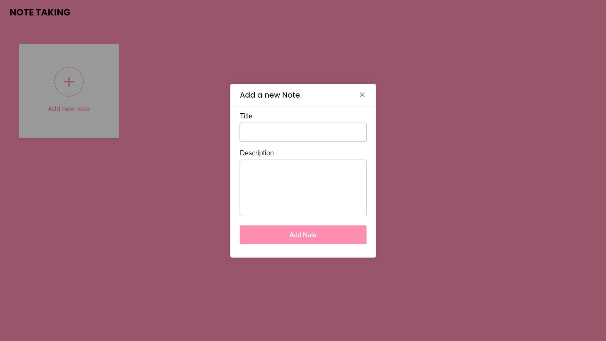
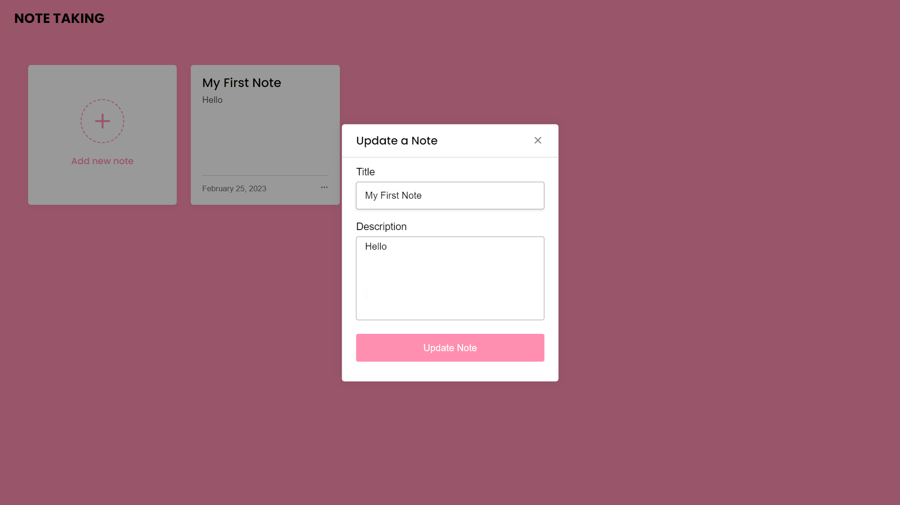
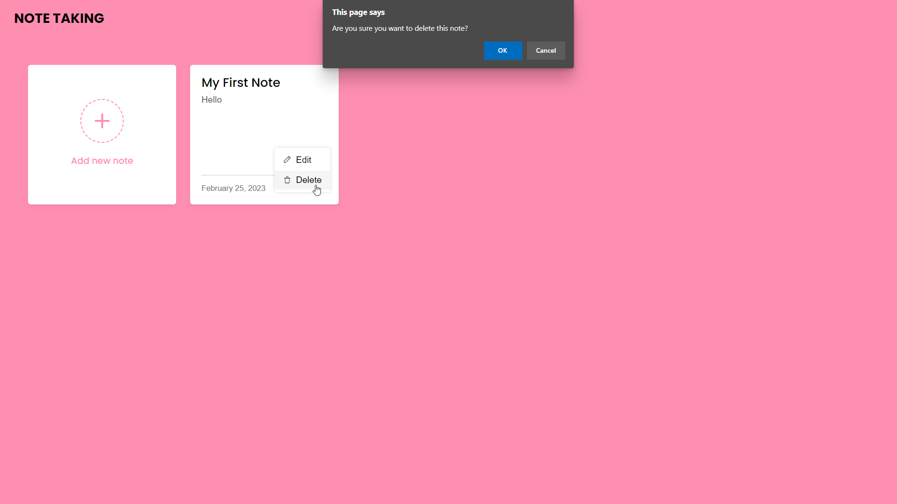

<br/>

## Table Of Contents

- [Table Of Contents](#table-of-contents)
- [About The Project](#about-the-project)
- [Built With](#built-with)
- [Screenshot](#screenshot)
- [Getting Started](#getting-started)
  - [Installation](#installation)
- [Usage](#usage)
- [Authors](#authors)
- [Acknowledgements](#acknowledgements)

## About The Project


The project is a simple note-taking application built using HTML, CSS, and JavaScript. It allows the user to enter and save notes, which are stored in the browser's local storage.

The user interface consists of a text area where the user can enter their notes, and a **"Add Note"** button which the user can click to save the notes. When the "Save" button is clicked, the notes are saved to local storage using the localStorage object provided by the browser's JavaScript API.

When the page is loaded, the application checks if there are any previously saved notes in local storage, and if so, it loads them into the text area so the user can continue editing their notes.

This project is a simple example of how to use local storage in a web application to persist data between page loads. It can be extended and modified to suit the needs of a particular project or application.

## Built With

The note-taking application is built using the following technologies:

* HTML: This is used to create the structure of the application's user interface.

* CSS: This is used to style the application's user interface and make it visually appealing.

* JavaScript: This is used to add interactivity to the application, handle user input and store/retrieve data from the browser's local storage.

* Local Storage: This is a feature provided by web browsers that allows web applications to store data on the client-side, i.e., in the user's browser. In this application, local storage is used to store the notes entered by the user so that they persist between page loads.

Overall, the application is built using front-end web technologies, and it does not require a back-end server or a database to function. It can be hosted on any web server or can be run locally on a user's machine.

## Screenshot







## Getting Started


This is an example of how you may give instructions on setting up your project locally.
To get a local copy up and running follow these simple example steps.


### Installation

1. Clone the repo

```sh
https://github.com/uk-krish/Note.git
```

2. Open The index.HTML file

3. Have fun!

## Usage
To use the note-taking application, follow these steps:


1. In the note-taking area, type in the notes that you want to save.

Click on the **"Add Note"** button to save the notes to the browser's local storage.

3. The saved notes will be loaded automatically from the local storage and displayed in the note-taking area.

4. To modify the saved notes, click on the **Edit** button, which is a button you can edit the saved notes.

5. To clear the saved notes, click on the **"Delete"** button, which is a button you can add to the application that will clear the notes from the local storage.

## Authors

* **Unnikrishnan** ([uk-krish](https://github.com/ShaanCoding/)) - *All Work*

## Acknowledgements

* [ShaanCoding](https://github.com/ShaanCoding/)
* [Othneil Drew](https://github.com/othneildrew/Best-README-Template)
* [ImgShields](https://shields.io/)
